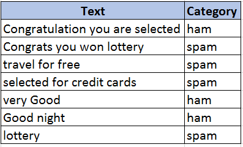

# Machine Learning with Java - Part 5 (Naive Bayes)

In my previous article we have seen series of algorithms :  [Linear Regression](https://tech.io/playgrounds/3771/machine-learning-with-java---part-1-linear-regression) , [Logistic Regression](https://tech.io/playgrounds/34a7ecd0a4487577f516d92548af66891284/machine-learning-with-java---part-2-logistic-regression) , [Nearest Neighbor](https://tech.io/playgrounds/5439/machine-learning-with-java---part-3-k-nearest-neighbor),[Decision Tree](https://tech.io/playgrounds/5844/machine-learning-with-java---part-4-decision-tree) and this article describes about the Naive Bayes algorithm.The simplest solutions are the most powerful ones and Navie Bayes is the best example for the same.

# Naive Bayes

Naive Bayes is a family of probablistic algorithm that takes an advantage of probability theory and Bayes theory to predict the category of sample.A Naive Bayesian model is easy to build, with no complicated iterative parameter estimation which makes it particularly useful for very large datasets.

# Example 

To find whether an email is ham or spam, we have training samples listed below

 <B> Training Data </B>    

now we will calculate which category the sentence "you won lottery" belongs to?
Naive Bayes is a probablistic classifier. To determine whether an email is ham or spam, we want to calculate the probability that the sentence "you won lottery" is ham and the probability that its spam. After the calculation we will take the largest one.

# How to calculate the probabilities?

The probabilities are calculated using the word frequencies.It is calculated using some basic properties of probabilities and the Bayes theorem.The conditional probabilities like the one discussed here will suits for the Bayes theorem.

P(A | B) = (P(B | A) * P(A) )/ P(B)

Let us do one sample exmaple to understand the probability calculation.

P(ham| you won lottery) = (P(you won lottery | ham) * P(ham) )/ P(you won lottery)

In  our classifier, we are trying to find out the category which has the bigger probability.so we can discrad the divisor and perform how many times the sentence "you won lottery" appears in ham category divide it by the total and obtain P( you won lottery | ham)

we here assume that every word in a sentence is indepedent of the other ones.so, we are not looking into entire sentences but rather at individuals words.Example : "Good things are "  and "things are Good" are same.

P( you won lottery | ham ) = P(you | ham ) * P( won | ham ) * P( lottery | ham )

P( you won lottery | spam ) = P(you | spam ) * P( won | spam ) * P( lottery | spam )

with this above formula we will find which one this sentence belongs to.

There are cases, some of the words will not be in training sets and the value is 0. The multiplication of 0 with others will be 0.
In order to avoid this, we are going to use Laplace smoothing .i.e., we will add 1 to every count so it will not be zero

The words are listed in the above table.
The total number of words : 15
The total number of ham words : 7
The total number of spam words : 10

You won Lottery ?

P(you | ham ) = (1 + 1)/(7 + 15)

P(you | sapm ) =(1 + 1)/(10 + 15)

Like the above we will calculate for every words and multiply using the above probability. The results for the one who have higher probability won.

You won Lottery belongs to spam category

# Naive Bayes Multinominal Demo

@[Naive Bayes Demo]({"stubs": ["src/main/java/com/gg/ml/NaiveBayesDemo.java"], "command": "com.gg.ml.NaiveBayesDemoTest#test"})

# Code Explanation

In the above example, we have used the multinominal weka classifier for naive bayes. We can use other naive bayes classifier in weka.If you want to try out different classifier just instantiate the specific classifier in the code (Line number 64 in code) and work on the same.

# Advantages

1. Easy to understand and implement

2. The classifier model is fast to build

3. No optimisation is required 

4. Easily updatebale if new training data is received

5. Performance is good

# Challenges with Naive Bayes

Inspite of its many strengths and robust performance, there are well known weaknesses with this classification technique,

1. Incomplete training Data - In our case also to overcome this , we have done smoothing so that the probability wont be zero if any of the words are not in training set.

2. Continuous Variable - The probabailty computation by the traditional method of frequency count is not possible.

3. Attreibute indepedence - This requires a little bit of extra effort. In the calculation of outcome probabilites , the implicit assumption is that all the attributes are mutually independent. This allows us to multiply the class conditional probabilities in order to compute the outcome probability.

